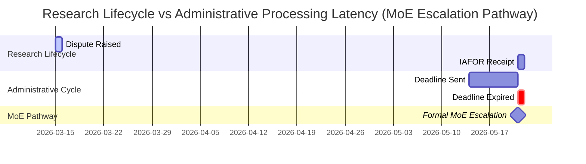

# Governance Log: Timeline Visualization

## Administrative Conflict Timeline (Mermaid)

## Cross-Referenced Event Index

- [[2026-05-21]] : International Review Notification, Deadline Expiry, and preparation for MoE formal petition filing.